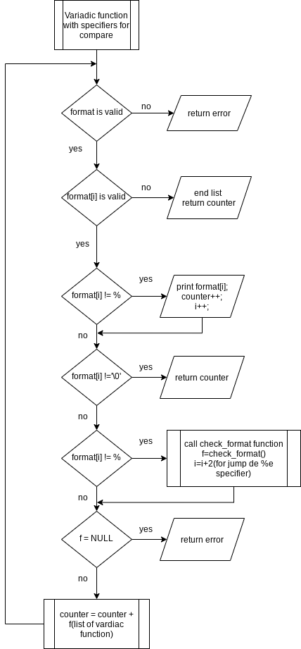
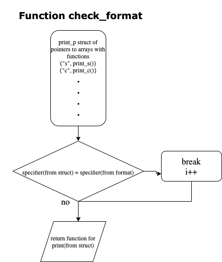

Project:- 0x11. C - printf PROJECT by "Ernest Thompson and Girum Getachew"

- In this project we can print a file and we must not push any c file containing a main function in the root directory and must use a test folder that contains all our tests including main funtions
- Our main files are include our main header file eg. "main.h", #include "main.h"
- This project contains flowcharts

   
   

The project have 2 mandatory questions and 14 advanced questions which are listed below

0. I'm not going anywhere. You can print that wherever you want to. I'm here and I'm a Spur for life
1. Education is when you read the fine print. Experience is what you get if you don't
2. With a face like mine, I do better in print
3. What one has not experienced, one will never understand in print
4. Nothing in fine print is ever good news
5. My weakness is wearing too much leopard print
6. How is the world ruled and led to war? Diplomats lie to journalists and believe these lies when they see them in print
7. The big print gives and the small print takes away
8. Sarcasm is lost in print
9. Print some money and give it to us for the rain forests
10. The negative is the equivalent of the composer's score, and the print the performance
11. It's depressing when you're still around and your albums are out of print
12. Every time that I wanted to give up, if I saw an interesting textile, print what ever, suddenly I would see a collection
13. Print is the sharpest and the strongest weapon of our party
14. The flood of print has turned reading into a process of gulping rather than savoring
15. *
